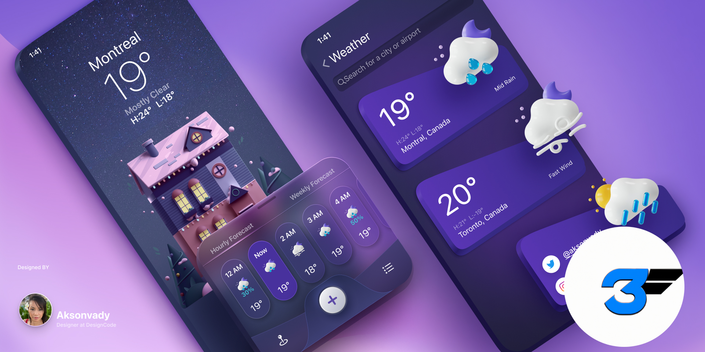

# weather_app

localDB: [isar](https://pub.dev/packages/isar)  
api: [open-meteo](https://open-meteo.com/en/docs)  
state-management: nah,InheritedWidget is ok

[FigmaDesign](<https://www.figma.com/design/8f5YOv66CcekwheMZCPo55/Weather-App-UI-Design-(Community)?node-id=2-4&node-type=canvas&t=CIDhXTozQ2da8LuG-0>)

A new Flutter project to spends sometime on boredom. Feel free to share the issue with a pr😁 ;

[checkout Boring live coding playlist](https://www.youtube.com/playlist?list=PLJRD2DHHHjSjE7xvkOTX9P9y0gpi4fN0Z) ; fyi self practice session

