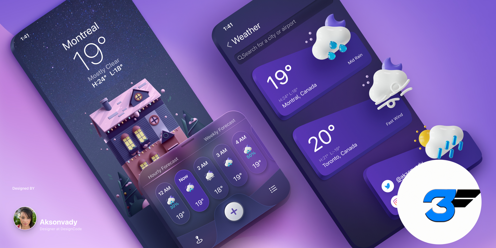

# weather_app

localDB: [isar](https://pub.dev/packages/isar)  
api: [open-meteo](https://open-meteo.com/en/docs)  
state-management: nah,InheritedWidget is ok

---

Todo:
https://pub.dev/packages/weather_icons_animated
https://github.com/basmilius/meteocons

---

- 3D icon Set by PIQO: https://www.figma.com/co mmunity/file/1146367922524307345

- Mikołaj Niżnik :: 3D Weather icons: https://www.figma.com/community/file/1023658389987124693/mikoaj-niznik-3d-weather-icons

A new Flutter project to spends sometime on boredom. Feel free to share the issue with a pr😁 ;

[checkout Boring live coding playlist](https://www.youtube.com/playlist?list=PLJRD2DHHHjSjE7xvkOTX9P9y0gpi4fN0Z) ; fyi self practice session

